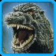

# Godzilla: Save the Earth (Playstation 2)

## Game Site
https://retroachievements.org/game/20849
## Overview
Godzilla: Save the Earth is the second game in the Pipeworks Godzilla trilogy serving as a sequel to Godzilla: Destroy All Monsters Melee. The game was released on November 2, 2004 for the Playstation 2 and on November 16, 2004 for the Xbox. 
## Set Design
The set covers beating the Action mode with all characters on any/Hard difficulty, beating the Survival mode with all characters on Hard difficulty, and achievements for purchasing all items in the shop. There are also achievements for specific Team Battle and Free for All matchups. Each of the in-game Challenges has a relevant achievement as well. 
